# NITRO 1: Getting Started

## Overview

In this exercise, you will begin to get familiar with the RESTful
NetScaler NITRO API.


## Exercise 1: The NetScaler NITRO Documentation

1.  The first step is to learn where to download the latest NetScaler NITRO documentation.

First, login to your NetScaler and head to the **Downloads** tab at the top right of the NetScaler GUI.

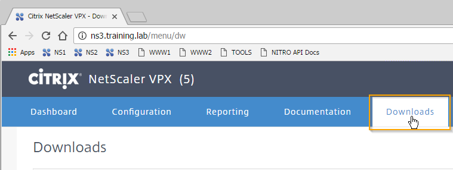

Scroll down and you will find the **NITRO section** with the SDK and documentation for all the programming languages the NITRO API has documentation or an SDK for. In our lab, we will be using the REST methods to connect to the NetScaler, therefore the documentation we will be using is the NITRO API Documentation. Download the **NITRO API Documentation** and extract them fully.  There are multiple compressed archives nested within.

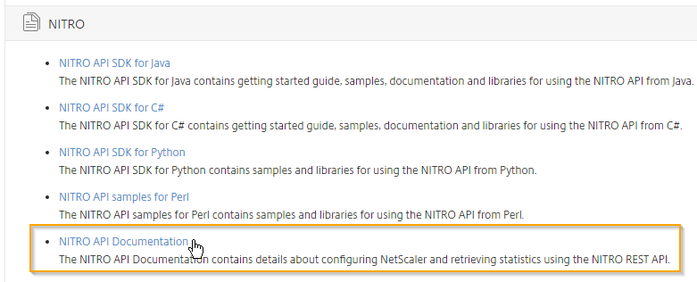

2.  Logout of NS3 by selecting **nsroot** at the top right dropdown and selecting **Logout**.

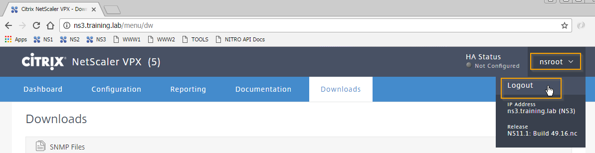

  1.       We can head to the NetScaler NITRO REST API Documentation by opening the index.html page within the documentation you extracted. Here we can see the Getting Started Guide, as well as the sidebar that contains the REST resources available to us via the API.

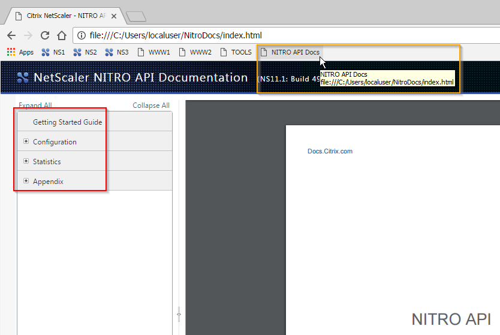

The documentation will be your go-to place for all information relating to the NITRO API. For example, below you can see the **configuration -&gt; basic -&gt; nstrace** functionality expanded. This resource allows you to interact with nstrace (a method to take a packet capture from the NetScaler to capture the network packets being received and sent).

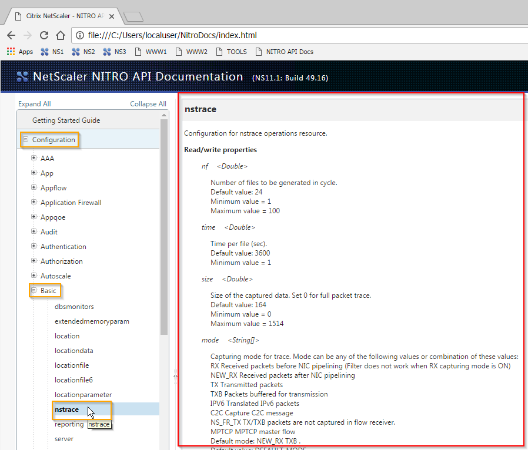

> Info   *This is not necessary now, but at any time responses to your requests get hung up or stuck and you are sure you have the request correct, it is a good troubleshooting step to close and reopen postman, and then perform a logout followed by a login.*

#### Exercise 2.3: Login to NetScaler

1.  Our first step in any and every interaction with NITRO is to perform a login to authenticate our user. In this step, we will head to the **Getting Started Guide and go to page 5**, which contains all the NITRO login information to build our REST request. Make note of the **URL, Method, Headers, and Payload** as we will use this information in the next step.

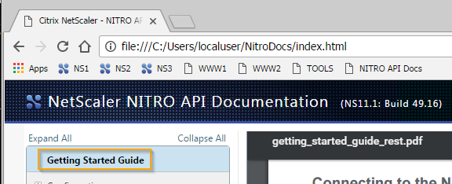

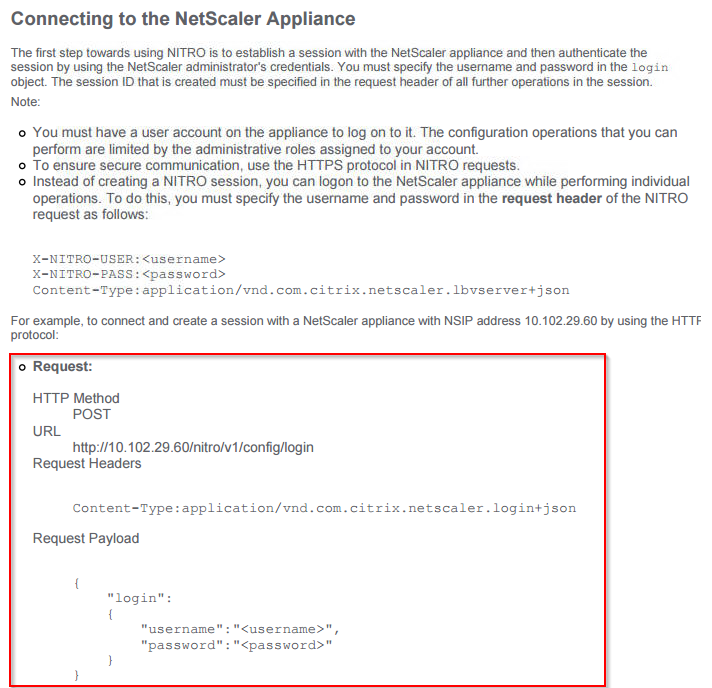

2. ***Login*** In this step, we will perform a login to the NetScaler. To do so open **Postman** and click on the **Plus (+) button**.  Enter [**http://ns3.training.lab/nitro/v1/config/login**](http://ns3.training.lab/nitro/v1/config/login) as the **request URL** and set the **HTTP Method** to **POST** as the documentation above states. Select **Headers,** if not already selected, and add a **key** of **Content-Type** and **value** of **application/json**

> Note: The Content-Type header is an important field when performing a HTTP POST and PUT to NITRO and it needs to be present (HTTP GET and DELETE are a different subject and we will detail them later). When performing, these operations be sure to include this header, with the appropriate value of application/json. It is important to note that the PDF getting started guide lists the appropriate value for this method of application/vnd.com.citrix.netscaler.login+json, and while that value will work it is best practice to utilize application/json in every request.

> Also, remember that whitespace in JSON is not vital, but double quotes, commas, colons, and brackets are.

Finishing our request, we will select **Body and Raw** as our payload and enter the data of:
```json
{
  "login":
  {
    "username":"nsroot",
    "password":"nsroot",
    "timeout":900
  }
}
```

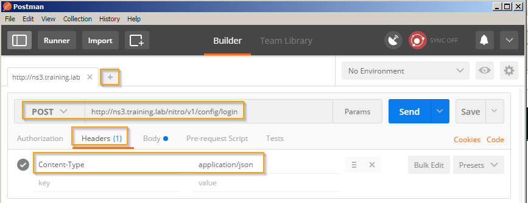

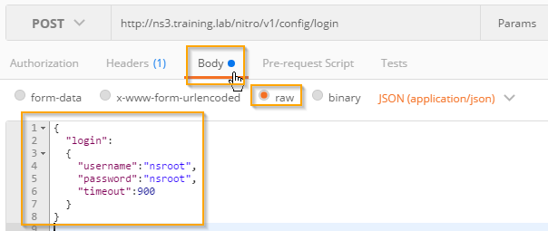

3.  Submit the response by clicking on **Send**. Verify that you are logged in by receiving a **HTTP Status of 201 Created**. Also, verify that the **sessionid** exists in the Cookie by clicking the **Cookies tab**.

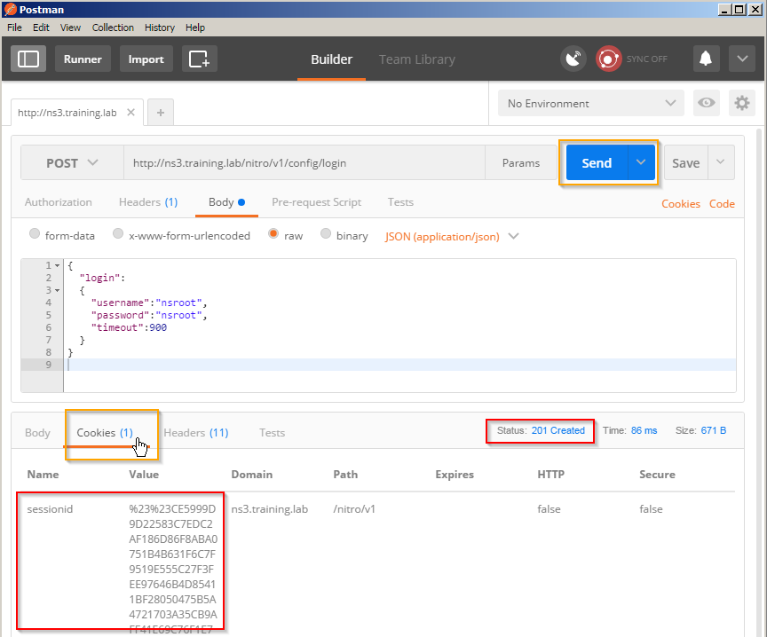

> Note: The sessionid is an important piece of all communications via NITRO. Each NITRO request you must include the cookie containing the sessionid so that you can operatevia your session. The Postman client automatically takes care of including the cookie within your requests, so you do not needto worry about it for this lab, but if you develop your own scripts aware of the token and cookie and be sure to include them.

> Troubleshooting Note (Important and useful for issues where you try to login, but receive an error and your request values are set correctly):

>> Click on the **Cookies** link in the request box next to the Save button. Find all instances of **sessionid** and click the **X** next to it to delete all of them. Close the box and try your request again by clicking **Send**.

> Troubleshooting step images, if needed:
> 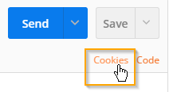
> 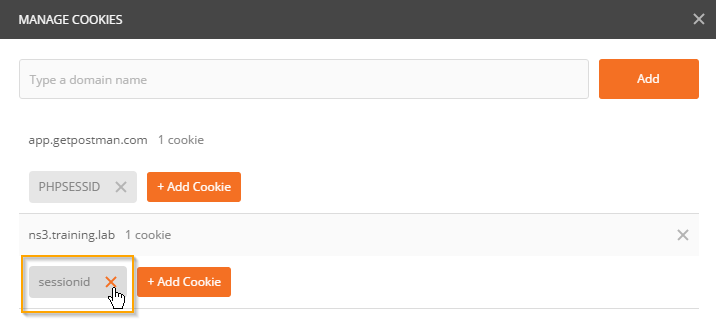

#### Exercise 2.4: Save NetScaler’s Configuration

1.       ***Save Configuration***

Within Google Chrome head to the **NetScaler API Docs**. Head to **Configuration -&gt; NS -&gt; nsconfig** and scroll down to find the **save method**. Make note of the same fields as above: **URL, HTTP Method, HTTP Params, and payload**.

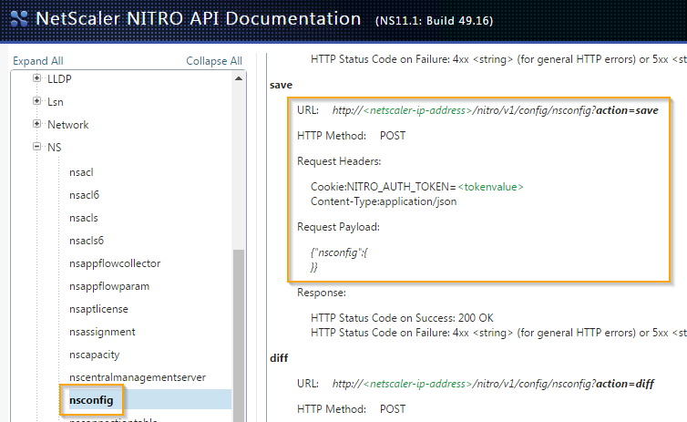{width="5.375in" height="3.3001388888888887in"}

Build your request by clicking the **Plus (+)** in Postman to save the configuration of the NetScaler using the resources you took note of above. Enter [**http://ns3.training.lab/nitro/v1/config/nsconfig**](http://ns3.training.lab/nitro/v1/config/nsconfig) as your **request URL** and **HTTP Method** of **POST**. This time be sure to select **Params and Headers** as we need to pass both to NITRO with this request as per the documentation. Enter a **Param Key** of **action** with the value of **save** add a **Header** key of **Content-Type** with the value of **application/json** Finally, select **Body and** **raw** as the payload and enter the data of:

{

"nsconfig":

{

}

}

  1.       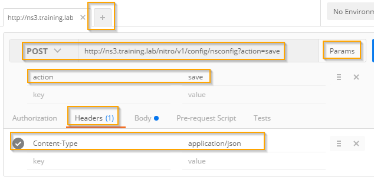{width="5.461376859142607in" height="2.6354166666666665in"}

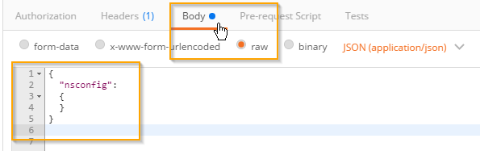{width="5.336977252843394in" height="1.6770833333333333in"}

  1.       Send the request to save the configuration by clicking **Send**. You can verify that the request was successful by looking at the **HTTP status of 200 OK**.

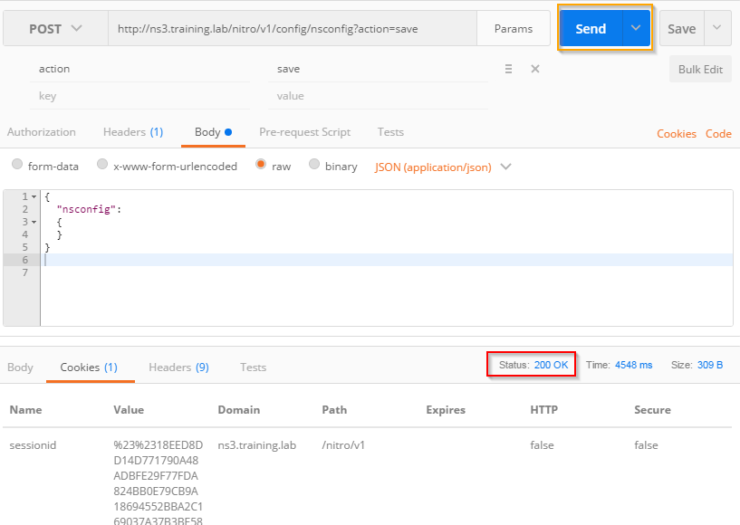{width="5.891666666666667in" height="4.182638888888889in"}
  ----------------------------------------------------------------------------------------------------------------------------------------------------------------------------------------------------------------------------------------------------------------------------------------------------------------------------------------------------------------------------------------------------------------------------------------------------------------------------------------------------------------------------------------------------------------------------------------------------------------------------------------------------------------------------------------------

#### Exercise 2.5: Logout

  ----------------------------------------------------------------------------------------------------------------------------------------------------------------------------------------------------------------------------------------------------------------------------------------------------------------------------------------------------------------
  > Step   Action
  -------- -------------------------------------------------------------------------------------------------------------------------------------------------------------------------------------------------------------------------------------------------------------------------------------------------------------------------------------------------------
  1.       ***Logout***

The next step is to logout or disconnect from the NetScaler. First we look up the documentation in the **Getting Started Guide**. In the guide, we will look for disconnecting from the appliance. Here we make note of the **URL, HTTP Method, Request Header, and payload.** *(pg.29)*

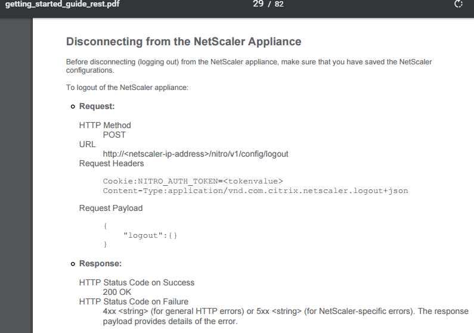{width="5.40625in" height="3.801707130358705in"}

We enter [**http://ns3.training.lab/nitro/v1/config/logout**](http://ns3.training.lab/nitro/v1/config/logout) as the **request URL** and the **HTTP Method of POST**. Be sure to select headers and add a key of **Content-Type** and value of **application/json** Finally, we will select **Body and raw** as our payload type and set the data of:

{"logout":

{

}

}

Click on **Send** and verify that the logout occurred by receiving a **201 Created as your HTTP Status. **

  1.       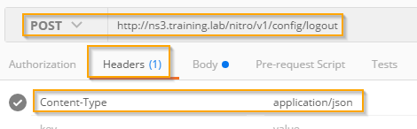{width="4.896516841644795in" height="1.5210454943132108in"}

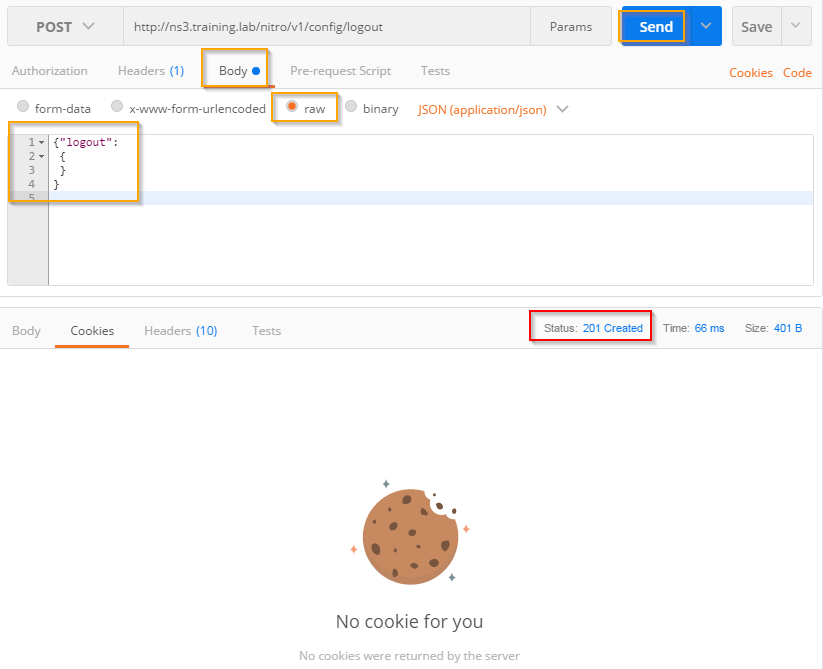{width="4.708333333333333in" height="3.8276017060367455in"}

**Click Send again and you receive a 401 Unauthorized – Why does this occur?**

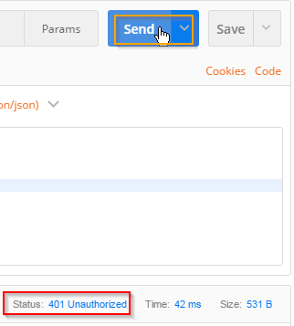{width="2.53125in" height="2.806385608048994in"}

*401 Unauthorized shows that we are not currently logged in (IE: The cookie sessionid is *not* set and/or not valid) and we are not allowed to perform a NITRO command without logging in first.*

  1.       ***Challenge! Reboot the NetScaler using NITRO***

Using the API documentation at **Configuration -&gt; NS -&gt; Reboot** build the request to ***warmly*** reboot your NetScaler and send it to NS3.training.lab. You will be using the reboot method and be sure set **warm: true**

{width="5.891666666666667in" height="2.6006944444444446in"}

Also, the return value should be a 200 or 201. The API can and will send return values or HTTP status codes per request, verify that the NetScaler rebooted via either firing up XenCenter and checking the NS3 console, or opening CMD and pinging ns3.training.lab.

***Hints below!***

Hint 1:

You might need to clear the cookies in Postman using the troubleshooting step outlined in the login steps above.

Hint 2: (copy and pasting might mess up formatting for “ ” characters, try to type it out)

Your payload information will be **{"reboot": {"warm": true}}**

*Note: Remember, whitespace in JSON doesn’t matter.*

Hint 3:

Are you logged in?

Hint 4:

Your URL will be <http://ns3.training.lab/nitro/v1/config>/reboot with the HTTP Method of POST

Hint 5:

Be sure to set that Content-Type header correctly! (*application/json)*
  ----------------------------------------------------------------------------------------------------------------------------------------------------------------------------------------------------------------------------------------------------------------------------------------------------------------------------------------------------------------

### Exercise Summary

In this exercise, you connected to NetScaler using the NITRO API. We
performed logging in, logging out, saving the configuration, and
rebooting the appliance.